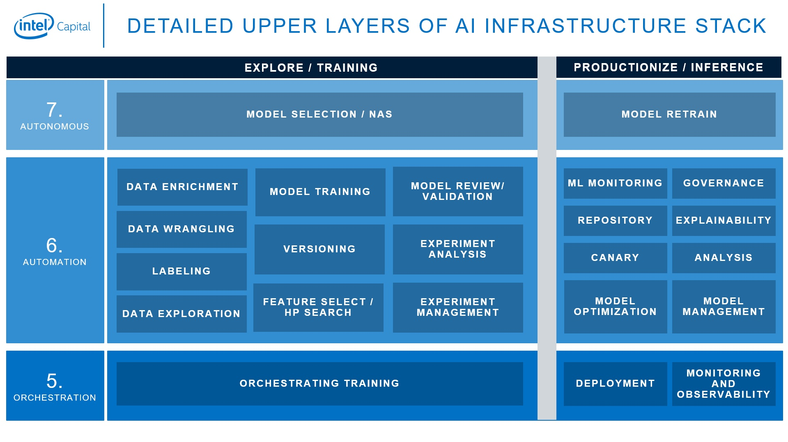

# AI-Powered IT Infrastructure Optimization Tool



## Overview

This project is an AI-powered IT infrastructure optimization tool designed to help IT Managers, AI Engineers, System Administrators, and Business Analysts efficiently manage and optimize their infrastructure setup. It provides a simple login system, a session-based authentication mechanism, and role-based access control.

## Features

- User authentication with Passport.js.
- Session management using express-session.
- Role-based access control.
- Simple and easy-to-use dashboard.
- HTML-based login page.

## Technologies Used

- Node.js
- Express.js
- Passport.js
- Body-Parser
- Express-Session

## Installation and Setup

Follow the steps below to set up and run the project on your local machine.

1. **Clone the repository**

```sh
$ git clone https://github.com/yourusername/ai-it-infrastructure-optimization.git
$ cd ai-it-infrastructure-optimization
```

2. **Install dependencies**

```sh
$ npm install
```

3. **Run the application**

```sh
$ npm start
```

The application will start running on `http://localhost:3000`

## Project Structure

```
.
├── index.js
├── middleware
│   └── auth.js
├── public
│   └── index.html
├── package.json
└── README.md
```

- **index.js**: Main file where the Express app is created and server is started.
- **middleware/auth.js**: Middleware file for handling authentication.
- **public/index.html**: Static HTML file for the login page.
- **package.json**: File containing project metadata and dependencies.

## Usage

1. **Access the Login Page**:
   Open your browser and navigate to `http://localhost:3000`. You'll see the login page.

2. **Login**:
   Use the following credentials to log in:
   - Username: `admin`
   - Password: `admin`

   After successful login, you will be redirected to the dashboard.

3. **Dashboard**:
   The dashboard greets the logged-in user by their username.

## Authentication Flow

- The login form (`public/index.html`) submits the user credentials to the `/login` route.
- The `/login` route uses Passport.js with a local strategy to authenticate the user.
- If authentication is successful, the user is redirected to the `/dashboard` route, which is protected by the `ensureAuthenticated` middleware.
- The `ensureAuthenticated` middleware checks if the user is authenticated before allowing access to the `/dashboard` route.

## License

This project is licensed under the MIT License.

## Contributing

Contributions are welcome! Please open an issue or submit a pull request for any features or bug fixes.

## Contact

For any questions or inquiries, please contact [your.email@example.com](mailto:your.email@example.com).
